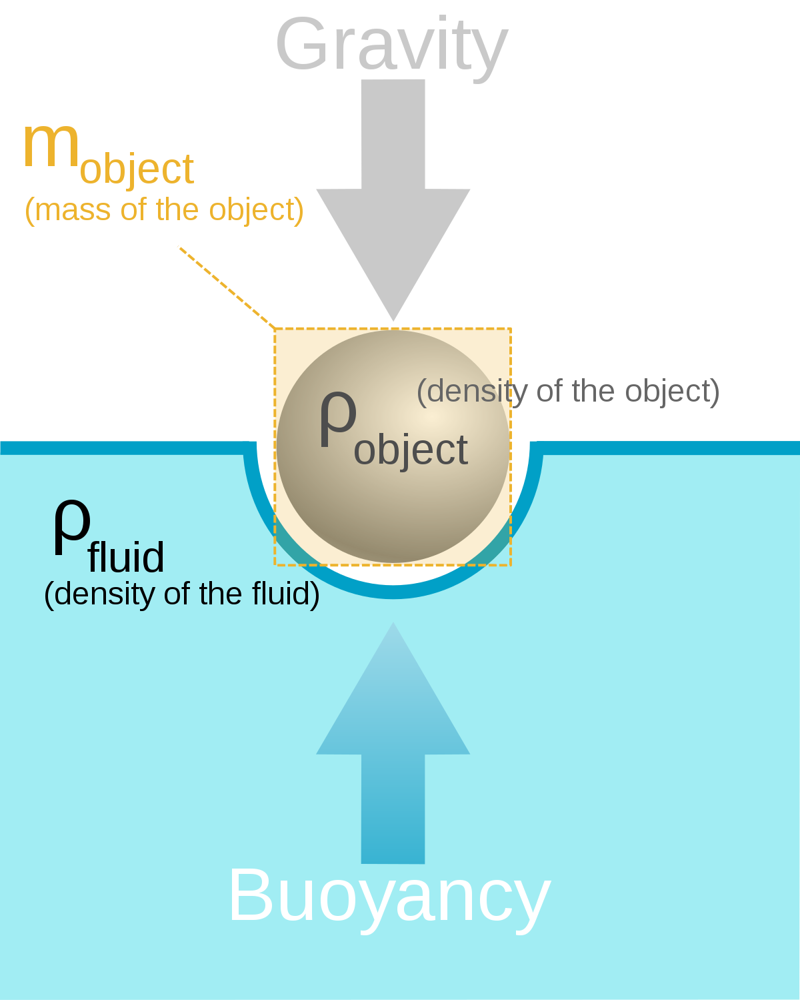

By: David Coe (Ph.D Candidate)

- 
    

Map by NOAA Climate.gov based on data provided by Philip Thompson, University of Hawaii.

## Why sea level rise matters

Sea-level rise is a major issue stemming from the bigger picture of Climate Change, and one that will have great impacts at the local and regional levels. Globally, it is estimated that 634 million people are at immediate risk due to sea-level rise, with the United States alone seeing around 40% of the population living in coastal areas.

Potential impacts to coastal regions include flooding, shoreline erosion, and storm surge and other effects from weather events. Regions around the world are already beginning to see stresses to the ecosystem that are associated with rising sea-levels as well. Fish and other wildlife are forming new habitats as oceans warm and sea-level rise is also causing off-shore aquifers to become contaminated with salt water, impacting ground water availability for crops and consumption.

### Drivers of Global Sea-Level Rise

Frederikse, T., Landerer, F., Caron, L. _et al._ The causes of sea-level rise since 1900. _Nature_ **584,** 393–397 (2020). [https://doi.org/10.1038/s41586-020-2591-3](https://doi.org/10.1038/s41586-020-2591-3)

Current understanding for changes in global sea levels breaks down to three major components: Thermal Expansion of Oceans, Ice Sheet and Glacial Melt, and Terrestrial Water Storage. Each of these three plays a unique role in why sea-level rise is occurring and their contributions can be seen in the above image. (Note that Thermosteric is the heat expansion, Barystatic is the Ice Sheet and Glacial Melt, and TWS is the Terrestrial Water Storage. The individual components of each are also shown in the figures.)

#### Thermal Expansion of Oceans

Figure from: NOAA climate.gov. Authors: [LuAnn Dahlman and Rebecca Lindsey](https://www.climate.gov/author/luann-dahlman-and-rebecca-lindsey)

Scientists and climatologists expect the average temperature of the Earth to rise between 1.5 and 4.5 degrees Celsius over the next 100 years due to increases in greenhouse gases in the atmosphere. These greenhouse gases prevent heat radiating from the surface of the Earth from escaping out into space. This heat is instead reflected back towards the surface of the Earth and part of it gets reabsorbed into the ocean. Long term, once glaciars and ice sheets are non-existent, this will become the main driver of sea-level rise.

The surface ocean has been seeing a large increase in heat content since the mid-1990s (see figure above). This is due to the ocean absorbing 10%-70% of heating due to greenhouse gases (studies are still uncertain exactly how much extra heating the oceans absorb).

http://www.chem1.com/acad/sci/aboutwater.html

The above chart shows the specific volume of water at different temperatures. Ice has the highest volume, due to the water molecules slowing down and becoming less dense, so the volume expands. If the volume did not expand, ice would be more dense and sink, which would lead to lakes and oceans freezing from the bottom up! Once water begins to warm, the volume does decrease, however, water has an interesting property that once it warms past 4°C, it begins to expand. Since our oceans are absorbing more heat and are already at temperatures well beyond 4°C, this added heating will cause them to expand further, causing sea levels to rise.

#### Ice Sheet and Glacial Ice Melt

One of the current main drivers of sea-level rise, ice sheet and glacial melt are estimated to have caused twice as much sea-level rise as thermal expansion since 1900. The above chart from NASA shows the extent of mass loss for the Antarctic Ice Sheet since 2000. There has been a significant decrease here and also in the Greenland Ice Sheet. The significance here is that both of these are land-based ice sheets.

https://commons.wikimedia.org/wiki/File:Buoyancy.jpg

When an object is placed on water, gravity forces it downwards, but the buoyant forces of the water on the object push against gravity to keep it floating. When you place ice in your drink, not only does it cool it down, but the ice itself floats. When the ice is placed in, the water level rises slightly due to the buoyant forces displacing an amount of water equal to the volume of the ice. Once the ice melts, you would expect the water level to rise further due to more water being added, however the water level remains where it was. This is because the buoyant forces already displaced a volume equal to the volume of the ice, so when it melts, there is no additional volume being added!

This means that when sea ice melts, there will be relatively no additional sea-level rise since the sea-level already rose to accommodate the sea-ice volume. Whereas when land-based glaciers and ice-sheets melt, this is additional water which enters the ocean from the land. This will cause significant increases in sea-level. For us here in North America, the loss of Antarctic ice-sheet mass is leading to a majority of the sea-level increase we are currently seeing.

http://nautil.us/issue/33/attraction/why-our-intuition-about-sea\_level-rise-is-wrong

Glacial and ice-sheet melt will also have an effect on sea-levels due to gravitational forces. They are big enough masses that they produce gravitational forces on the ocean waters. These forces cause water levels near them to rise as the water is attracted to them and global levels to fall. As the mass of these glaciers and ice-sheets decrease, the gravitational forces decrease. This will cause the water levels in the immediate area around them to fall, while globally this will cause water to retreat to areas further away from the gravitational forces. This will lead to additional sea-level rise, especially on the East Coast of the United States.

#### Terrestrial Water Storage

Terrestrial water storage consists of how our water is stored on land, in aquifers, in dams, etc. Currently, ground water storage across the world has been impacted due to pumping and droughts. If we look back, we see during the 1970s that Terrestrial Water Storage was at a near maximum and almost balanced out the sea-level rise we were seeing due to ice melt and thermal expansion. During this time, we saw an increase in the building of dams and artificial water reservoirs, which increased the amount of water being stored outside of the oceans and decreased the amount of terrestrial water being input into the oceans. Since however, most of these dams are either in the process of being deconstructed (due to environmental issues or age) and reservoirs are drying up due to drought conditions, making it less effective at balancing out the sea-level rise we are seeing.

## Conclusions

This report has found that the above conditions can explain in full the sea-level rise that has been observed since 1900. Thermal expansion and glacial/ice-sheet melt have been the main drivers, with thermal expansion playing a bigger role since the 1970s. As climate change continues and the Earth continues to warm, we will only see a continued feedback loop that causes the ocean levels to continue to rise. This is expected to cause more dangerous conditions for those living in coastal communities, not only causing tides to come further ashore, but storm surge events will become more frequent further inland than before.
